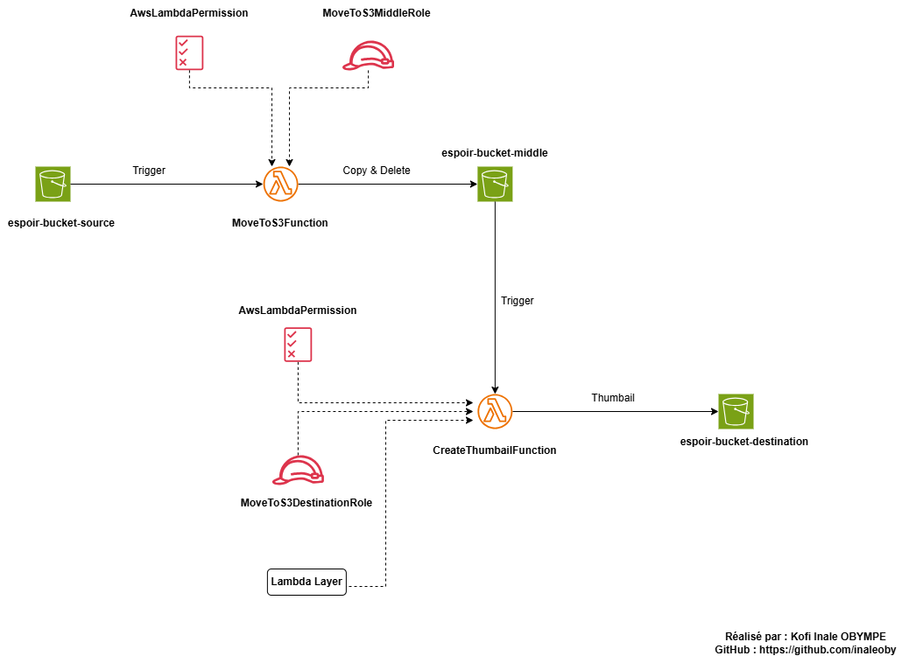

# AWS SERVERLESS AVEC LAMBDA ET S3

## Description

Ce projet implémente un pipeline serverless sur AWS permettant de traiter 
automatiquement des images. Lorsqu'une image est déposée dans un bucket S3 
source, une première fonction Lambda la déplace vers un bucket intermédiaire. 
Ce dépôt déclenche automatiquement une seconde fonction Lambda qui génère une 
miniature et la stocke dans un bucket de destination.

L'ensemble de l'infrastructure est provisionné avec Terraform, illustrant les 
bonnes pratiques IAM : resource-based policies, execution roles avec le principe 
du moindre privilège, et Lambda Layers pour les dépendances externes.

## Architecture



## Prérequis

- Terraform installé (version >= 1.0)
- AWS CLI installé et configuré
- Un compte AWS avec les droits suffisants
- Python 3.11

Configuration des credentials AWS :
```bash
aws configure
# AWS Access Key ID
# AWS Secret Access Key
# Default region : us-east-1
# Default output format : json
```

## Déploiement

1. Cloner le repo
```bash
git clone https://github.com/inaleoby/aws-lambda-terraform
cd aws-lambda-terraform/terraform
```

2. Initialiser Terraform
```bash
terraform init
```

3. Vérifier les ressources à créer
```bash
terraform plan
```

4. Déployer l'infrastructure
```bash
terraform apply
```

## Test

Uploader une image JPEG dans le bucket source :

Option 1 - Console AWS
```
S3 → espoir-bucket-source → Upload → choisir une image JPEG
```

Option 2 - AWS CLI
```bash
aws s3 cp mon-image.jpeg s3://espoir-bucket-source/
```

Option 3 - CloudShell (sans installation locale)
```bash
# Ouvrir CloudShell depuis la console AWS
aws s3 cp mon-image.jpeg s3://espoir-bucket-source/
```

Vérifier les résultats :
```
espoir-bucket-middle              → l'image originale
espoir-bucket-destination/thumbnails/ → la miniature 128x128
```

En cas d'erreur, consulter les logs CloudWatch :
```
Lambda → MoveToS3Function → Monitor → View CloudWatch logs
Lambda → CreateThumbnailFunction → Monitor → View CloudWatch logs
```

## Destruction

Détruire toutes les ressources créées :
```bash
terraform destroy
```

Important : les buckets S3 doivent être vides avant la destruction.
Le projet utilise force_destroy = true donc Terraform vide les buckets 
automatiquement avant de les supprimer.

## Structure du projet
```
aws-lambda-terraform/
├── terraform/
│   ├── main.tf        → buckets S3, fonctions Lambda, triggers
│   ├── iam.tf         → rôles et policies IAM
│   └── terraform.tf   → configuration du provider AWS
├── lambda/
│   ├── lambda1/
│   │   └── moveToS3Function.py
│   └── lambda2/
│       └── CreateThumbnailFunction.py
├── docs/
│   └── architecture.png
└── README.md
```

## Auteur

Réalisé par : Kofi Inale OBYMPE  
GitHub : https://github.com/inaleoby

## Credits

Lab inspiré par le cours de Amadou Merico.
linkedin : https://www.linkedin.com/in/amadoumerico